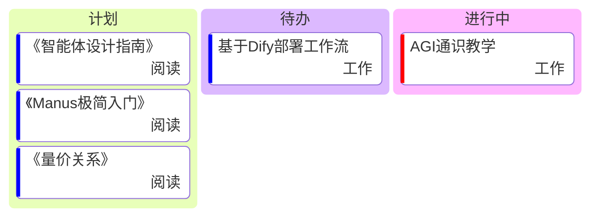

# 路线图
<!-- 
<iframe 
    src="https://bspwqyvx4f.feishu.cn/share/base/view/shrcnakNG2GuPaTPzudXQruZsVc" 
    width="100%" 
    height="600px" 
    frameborder="0" 
    scrolling="auto">
</iframe> -->
