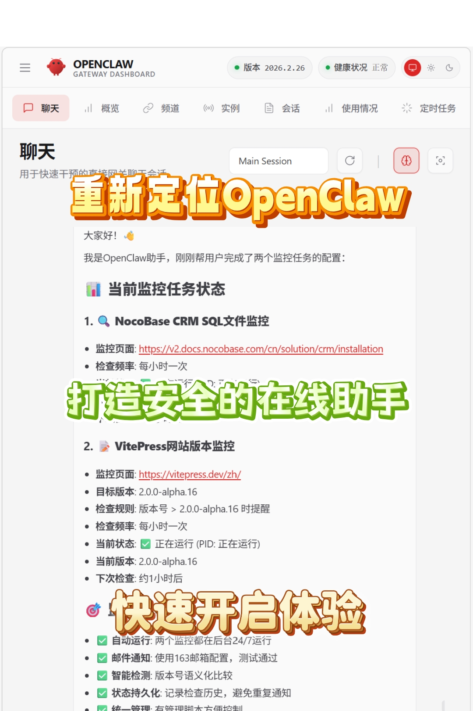
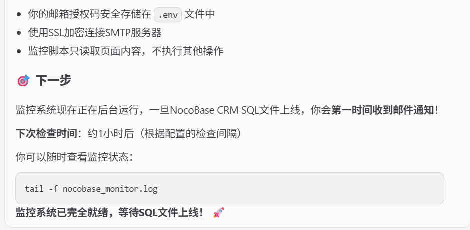
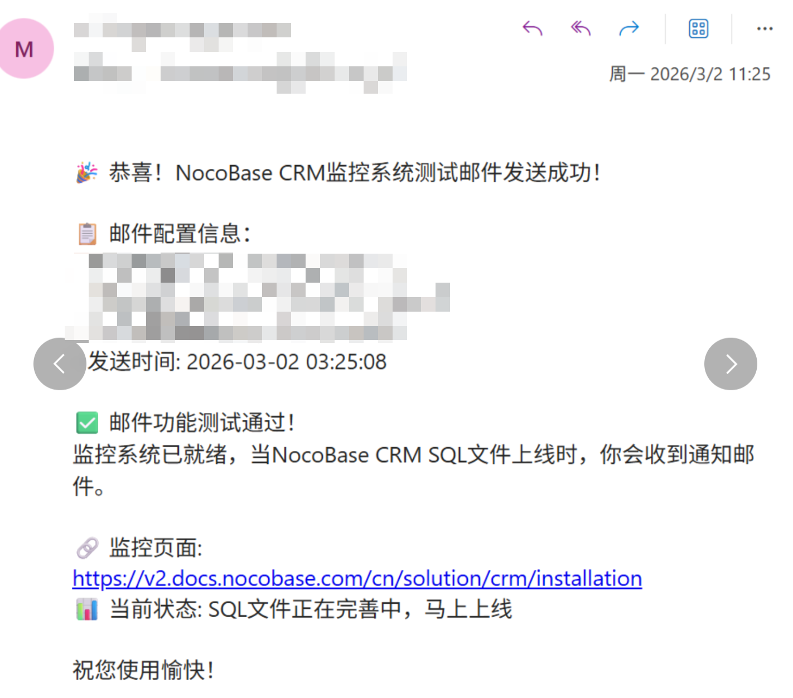

# OpenClaw快速安全轻量化体验方式

[[TOC]]

重新定位OpenClaw
安全的在线助手
快速开启体验

## 1 认清OpenClaw类型助手的发展现状
OpenClaw发布到现在，各种教程、体验视频无数，大家对它的态度两极分化：
- 一部分人认为它是一个有无限潜力的工具，能够帮助他们简化并高效完成任务，主动开始尝试使用。
- 另一部分人则认为它功能有限、风险过高，没有实际的价值。

我不否认OpenClaw的价值，但是要认清它只是AI技术发展到现阶段，一类应用方式的先行者，就像各种大模型竞赛初期，各种套壳应用蓬勃发展的那样，OpenClaw也只是在这个阶段的一个尝试。
我们可以去尝试它，**体验如何改变我们的认知和工作方式**，但是不要寄希望于完全依靠它来解决、替代我们的工作。

## 2 重新定义OpenClaw的功能定位
先来重新做一下定位：
1. 我知道OpenClaw有风险、功能有限，所以我不希望它有权限动我的本地文件和任何账号资产，所以我需要对它进行**物理隔离**，所以我选择放在云端；
2. 我知道它功能有限，而且隔离以后更是被阉割了功能，所以我只想让它代替我**做一些繁琐的定时任务**，包括检查更新内容、定时收集信息等等；
3. 我想要便宜一点，所以我选择最低配置的云服务器，和按量收费的大模型，因为我在下命令的时候会**限制执行次数**，节省token的消耗；
4. 国内配置各种IM工具要么很麻烦（比如TG），要么涉及到企业管理权限（比如飞书），所以我选择用邮件通知，因为我所有的命令通过WebUI发布，**手机端只用来接收通知**。

综上，它就是个只能靠网络资源，按我的要求一天n次去做一些我懒得做的刷网页，然后用邮件通知我结果的在线助手。

## 3 如何快速体验
**部署服务**
1. 阿里云购买一个99元/年的个人服务器，虽然只有2核1G，但是所有服务都可以用在线API，如果不跑其他服务足够了；
2. 安装1Panel v2，因为它可以一键部署OpenClaw，并且帮你处理好了各种容器设置和网络连接；
3. 选一个大模型，买个API，因为要等待即将发布的DeepSeek V4，我直接用了DeepSeek的API（其实主要只要是余额还有剩），官方是推荐MiniMax v2.1，选择CodingPlan标准版可以包月29元/月；
4. 1Panel的应用商店里，一键安装OpenClaw；
5. 在AI/智能体下，点击WebUI跳转，就可以看到OpenClaw的界面了；
6. 准备一个不用的或新申请一个邮箱。

**布置任务**
不要看网络上各种配置Skill、Channel的教程觉得复杂，因为OpenClaw的任务配置非常简单，**只需要在WebUI里正常对话，它会帮你生成对应的任务配置**。
例如，我现在使用NocoBase这个应用，但是它的一个配置文件还没有发布，我希望尽快用上它，只能不定时的一遍遍去手动刷新它的发布页面（这个页面也没有RSS），我想减负。
那么我对OpenClaw下发了以下命令：
1. 帮我监控一下这个网址：url，如果SQL文件可以下载了，用邮件通知我；
2. 直接帮我配置发送邮箱，然后帮我发送一封测试邮件到：email;
3. 发送邮箱的配置是：email，授权码<授权码>。

**执行任务**
然后我的邮箱就收到测试邮件，然后就开始运行监控任务了。

